# Data-efficient image Transformers (DeiT)

## Usage
- Pull the official swin repository from Microsoft by `git pull https://github.com/facebookresearch/deit.git`.
- Use `./main.py` to substitute the file with the same name in official repo.
- Give permission to shell scripts by running `$ chmod u+x <fileName.sh>`.
- To evaluate: Set path and run `$ ./eval.sh`.
- To train deit-tiny and deit-small from scratch on CIFAR-100: Set path and run `$ ./train_deit_cifar100.sh`.
- To train deit-small from scratch on ImageNet-1k: Set path and run `$ ./train_deit_imgnet.sh`.
- To fine-tuning deit-tiny, deit-small and deit-base on CIFAR-10 and CIFAR-100: Set path and run `$ ./transfer_deit.sh`.

## Evaluate Pre-trained Deit Models on ImageNet-1k

### Expected output

====== TINY ======

\* Acc@1 72.126 Acc@5 91.134 loss 1.220

Accuracy of the network on the 50000 test images: 72.1%

====== SMALL ======

\* Acc@1 79.812 Acc@5 94.940 loss 0.881

Accuracy of the network on the 50000 test images: 79.8%

====== BASE ======

\* Acc@1 81.806 Acc@5 95.596 loss 0.820

Accuracy of the network on the 50000 test images: 81.8%

## Pre-train deit-tiny on CIFAR-100

### Settings
| Parameters    | Value     |
| -----------   | ----------|
| # of epochs   | 300       |
| batch size    | 128       |
| optimizer     | AdamW     |
| learning rate | 5e-4      |
| weight decay  | 0.05      |
| warmup epochs | 5         |

### Result
For 300 epochs:
- Acc@1: 68.76%
- Acc@5: 90.87%
- Elapsed time: 10h 55mins

### Log Figure
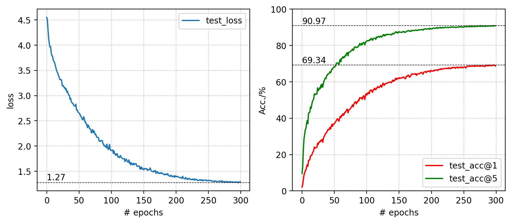

## Pre-train deit-small on CIFAR-100

### Settings
| Parameters    | Value     |
| -----------   | ----------|
| # of epochs   | 600       |
| batch size    | 64        |
| optimizer     | AdamW     |
| learning rate | 5e-4      |
| weight decay  | 0.05      |
| warmup epochs | 5         |

### Result
For 300 epcohs:
- Acc@1: 72.72%
- Acc@5: 90.87%
- Elapsed time: 24h 42mins

### Log Figure
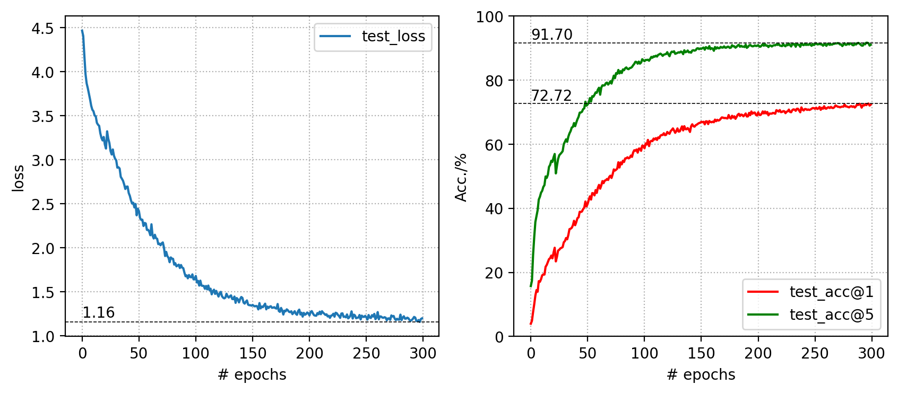

## Pre-train deit-small on ImgeNet-1k

### Settings
| Parameters    | Value     |
| -----------   | ----------|
| # of epochs   | 100       |
| batch size    | 128       |
| optimizer     | AdamW     |
| learning rate | 5e-4      |
| weight decay  | 0.05      |
| warmup epochs | 5         |

### Result
For 100 epcohs:
- Acc@1: 70.85%
- Acc@5: 90.21%
- Elapsed time: 9d 14h 37mins

### Log Figure
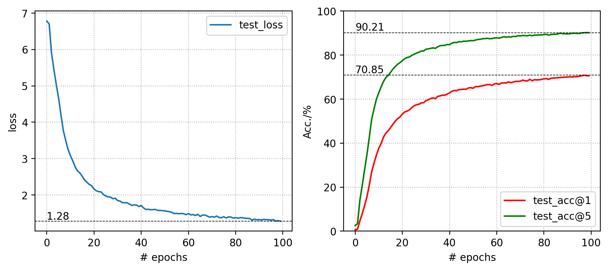

## Deit Transfer Experiments
### Settings
| Parameters    | Value     |
| -----------   | ----------|
| # of epochs   | 50        |
| batch size    | 64        |
| optimizer     | SGD with momentum     |
| momentum      | 0.9       |
| learning rate | 1e-2      |
| weight decay  | 1e-4      |
| warmup epochs | 5         |

### Transfer to CIFAR10

#### pretrained deit-tiny
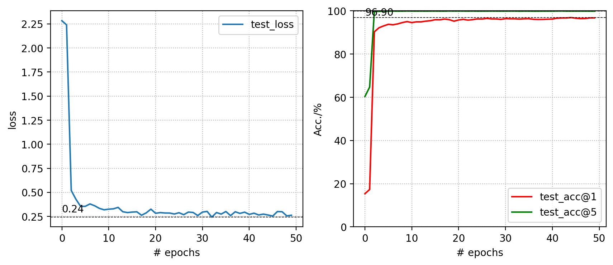

#### pretrained deit-small
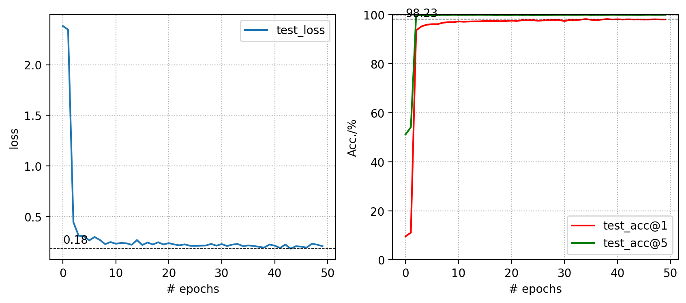

#### pretrained deit-base
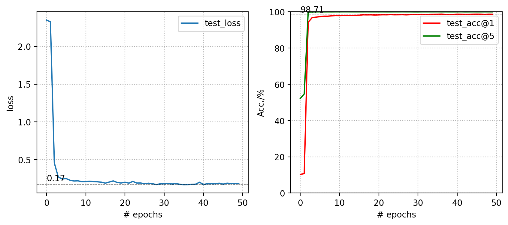

#### retrained deit-small
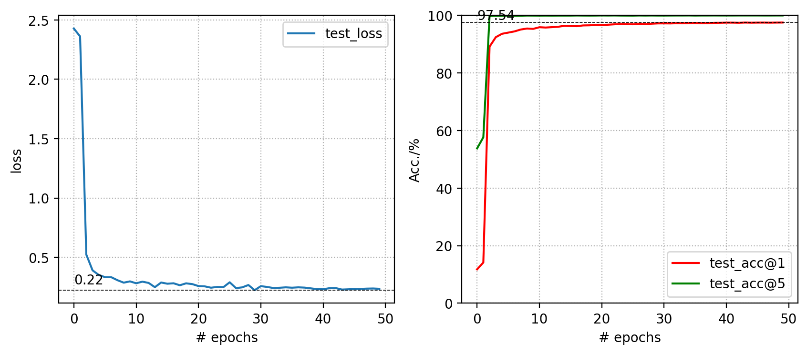

### Transfer to CIFAR100
#### pretrained deit-tiny
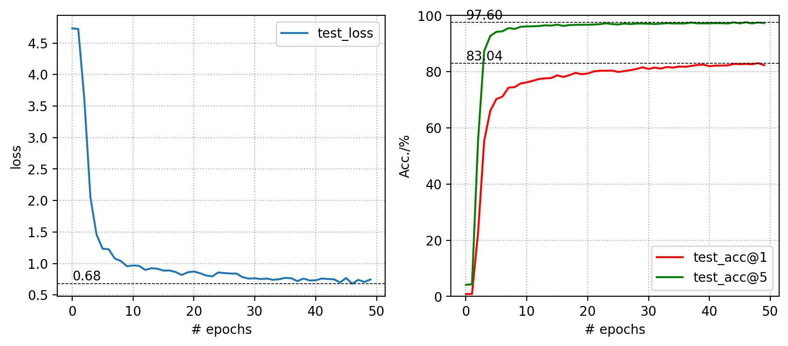

#### pretrained deit-small
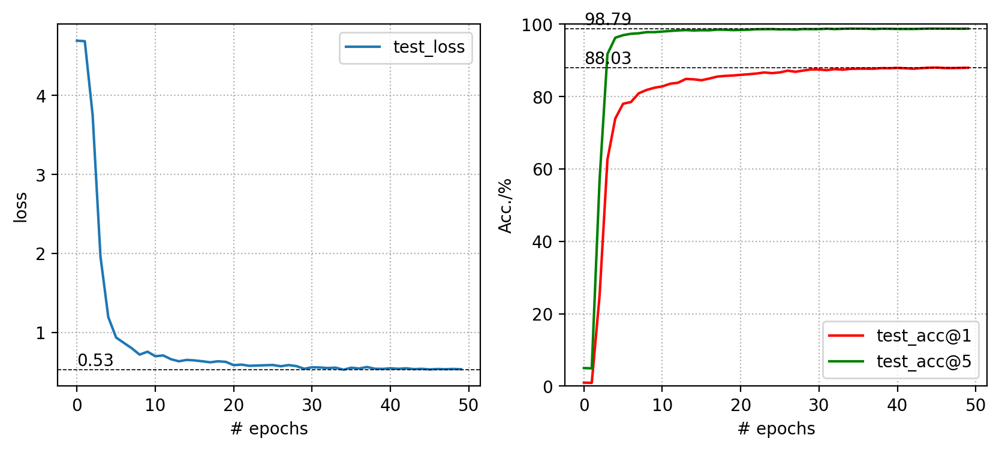

#### pretrained deit-base
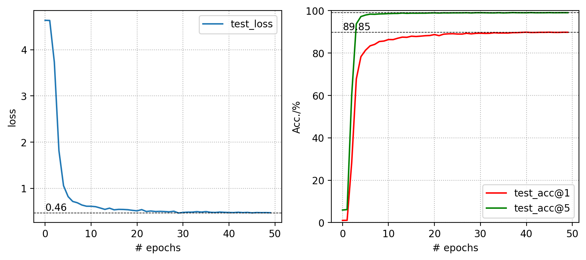

#### retrained deit-small
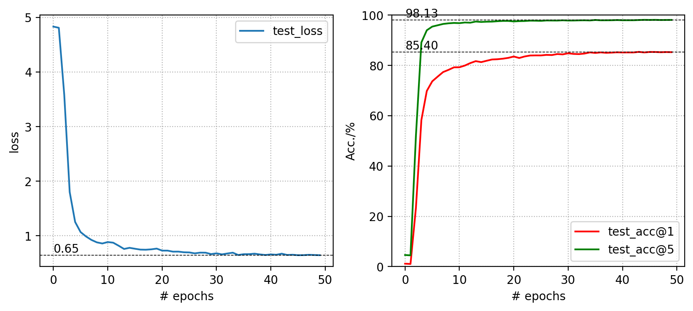

## Reference
[1] Official DeiT repository [[GitHub](https://github.com/facebookresearch/deit)]
