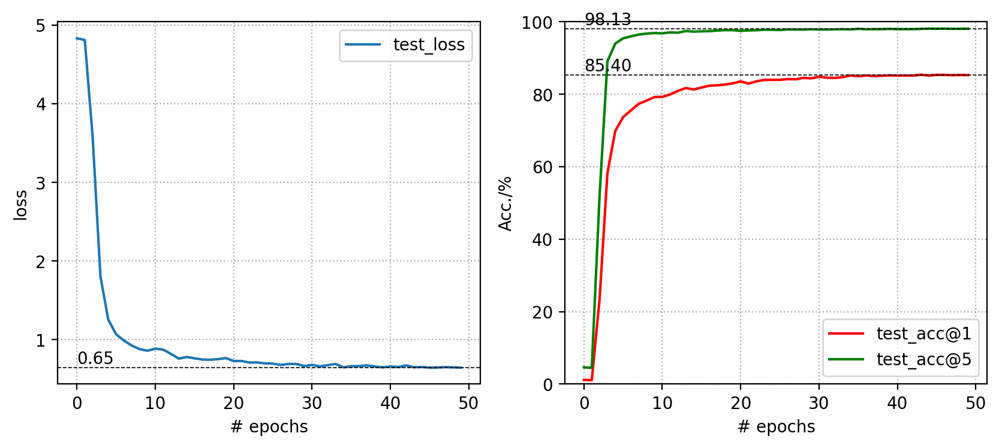

# Investigations of Vision Transformer and its Recent Improvements
### E6691 Final Project - Spring 2022

## Team information
- Team ID: VIST
- Team member:
  - Jiawei Lu (jl5999)
  - Zihui Ouyang (zo2151)
  - Jianfei Pan (jp4201)

## Introduction
Convolutional neural network (CNN) architectures have thrived and dominated the field of computer vision in the past decade, due to many of its advantages in dealing with image data such as translation equivalence, locality, inductive bias, and so on. However, in recent years, pure transformer architectures such as the Vision Transformer, adapted from the field of natural language processing (NLP), have demonstrated excellent ability and results in tackling image processing tasks, which does not rely on CNNs at all. In this report, the team will dive deep into understanding the recent year advances and improvements in the application of pure transformer architectures in the field of computer vision. 

Specifically, we will briefly introduce the Vision Transformer (ViT) and discuss its problems as well as its two improved successors, the Data efficient image Transformer (DeiT) and Swin Transformer (SwinT). We will analyze their performances in different computer vision tasks and back up our analysis with our own experiment data and that from the original papers. Lastly, we will talk about the difficulties we faced in trying to reproduce paper results and have fair comparisons, along with our innovations and insights gained from this project. 

## Outline
- Reproduce some results from the ViT paper on ImageNet-1k with the pre-trained ViT model and compare it with results that we reproduced with DeiT and Swin Transformer. 
- Analyze and compare their performances on fine-tuning the pre-trained models on smaller datasets. 
- Pre-train a DeiT transformer on ImageNet-1k from scratch, and then evaluate its transfer performance. 
- Show some innovations and fine-tune the ViT on a subset of data from ImageNet but are labeled incorrectly, from which we hope to gain insights into how robust and transferable ViT is on a small dataset with substantial noise and inaccurate labeling, and compare to some baseline CNN models. 

## Experiments
You can find instructions and detailed results in corresponding folders.
- ViT in folder `./ViT` [[Link](./ViT)]
- DeiT in folder `./DeiT` [[Link](./ViT)]
- SwinT in folder `./Swin` [[Link](./ViT)]
### 1. Fine tuning DeiT Transformer on CIFAR-10 and CIFAR-100

#### Implementation
Details are described in file [`./DeiT/README.md`](./DeiT/).

#### Results
- Fine tuning DeiT on CIFAR-10

  
  

- Fine tuning DeiT on CIFAR-100

  
  

### 2. Fine tuning Swin Transformer on CIFAR-10 and CIFAR-100

#### Implementation
Details are described in file [`./Swin/README.md`](./Swin/).

#### Results
- Fine tuning Swin on CIFAR-10

  
  

- Fine tuning Swin on CIFAR-100

  
  

### 3. Comparison of Models Fine tuning on CIFAR-10

#### Implementation
Details are described in file [`./DeiT/README.md`](./DeiT/).

#### Results
- Comparison of models fine-tuning on CIFAR-10, Validation Accuracy vs Inference Speed

  

### 4. Comparison of Models Fine tuning on CIFAR-10
#### Implementation
Details are described in file [`./DeiT/README.md`](./DeiT/).

#### Results
- Comparison of models fine-tuning on CIFAR-100, Validation Accuracy vs Inference Speed

  

### 5. Pre-train Deit on CIFAR-100 from scratch
#### Implementation
Details are described in file [`./DeiT/README.md`](./DeiT/).

#### Results
- Comparison of pre-training DeiT from scratch on CIFAR-100

  
  

### 6. Robustness Analysis of Vision Transformer on imagenette and imagewoof
#### Implementation
Details are described in file [`./ViT/README.md`](./ViT/).

#### Results
- Fine tuning ViT on imagenette

  

- Fine tuning ViT on imagewoof

  

### 7. Effort in optimizing results with extensive pre-training

#### Implementation
Details are described in file [`./DeiT/README.md`](./DeiT/).
#### Results
- Training curve for pre-training DeiT-S from scratch on ImageNet-1k

  

- Fine-tuning our pre-trained DeiT-S on CIFAR-10

  

- Fine-tuning our pre-trained DeiT-S on CIFAR-100

  

### 8. Summary of Pre-training Time (Selected)

|Model     | Training Time | Top-1 Acc | Top-5 Acc|
| ---     |   ---|  ---|    ---|   
|DeiT-Ti on CIFAR-100    | 10h 55mins |69.34 |90.97   |
|DeiT-S on CIFAR-100    | 24h 42mins |72.72 |91.70   |
|DeiT-S* on ImageNet-1k    | 9d 14h 37mins |70.85 | 90.21  |
|DeiT-S** on CIFAR-10    | 4h 24mins | 97.54  | 100.00 |
|DeiT-S** on CIFAR-100    | 4h 48mins | 85.40 |  98.13 |

More training time is under corresponding folders.

## All trained models
Details are in folder [`./models`](./models).

### Our DeiT Models pretrained on CIFAR-100
| name | acc@1 | acc@5 | #params | Google Drive url |
| --- | --- | --- | --- | --- |
| DeiT-tiny | 69.3 | 91.0 | 5M | [model](https://drive.google.com/uc?export=download&id=10WNtDUgZmkqW4fZMr5dr--sCqeN60Qf6) |
| DeiT-small | 72.7 | 91.7 | 22M| [model](https://drive.google.com/uc?export=download&id=10Y-UtKCcxty1HJ_RyL4e_qj3V69dfeZq) |

### Our DeiT Models pretrained on ImageNet-1k
| name | acc@1 | acc@5 | #params | Google Drive url |
| --- | --- | --- | --- | --- |
| DeiT-small | 70.9 | 90.2 | 22M| [model](https://drive.google.com/uc?export=download&id=10ajOPGmSuMyiJmB5y7i8InCVctRHx5Tm) |

### Official DeiT Models pretrained on ImageNet-1k

| name | acc@1 | acc@5 | #params | official url |
| --- | --- | --- | --- | --- |
| DeiT-tiny | 72.2 | 91.1 | 5M | [model](https://dl.fbaipublicfiles.com/deit/deit_tiny_patch16_224-a1311bcf.pth) |
| DeiT-small | 79.9 | 95.0 | 22M| [model](https://dl.fbaipublicfiles.com/deit/deit_small_patch16_224-cd65a155.pth) |
| DeiT-base | 81.8 | 95.6 | 86M | [model](https://dl.fbaipublicfiles.com/deit/deit_base_patch16_224-b5f2ef4d.pth) |

### Official Swin Models pretrained on ImageNet-1k

| name  |acc@1 | acc@5 | #params | official url |
|:---:|:---:| :---:| :---:|:---:|
| Swin-T  | 81.2 | 95.5 | 28M | [model](https://github.com/SwinTransformer/storage/releases/download/v1.0.0/swin_tiny_patch4_window7_224.pth)|
| Swin-S | 83.2 | 96.2 | 50M | [model](https://github.com/SwinTransformer/storage/releases/download/v1.0.0/swin_small_patch4_window7_224.pth)|
| Swin-B  | 83.5 | 96.5 | 88M | [model](https://github.com/SwinTransformer/storage/releases/download/v1.0.0/swin_base_patch4_window7_224.pth)|

## Conclusion
Our project studies the recent breakthroughs in applying Transformer architectures in computer vision. We started from the Vision Transformer architecture, one of the earliest successful attempt, and fine tune the pretrained the model on small dataset and compared it with other models. Moreover, we also analyzed its robustness to noise in the fine-tuning data, by training it on Imagenette and Imagewoof, datasets with wrong labels. While understanding the limitations of vanilla Vision Transformer, we then studied and implemented two famous ViT successors, DeiT and SwinT. DeiT improves the data efficiency of the ViT by introducing a teacher network during training, and SwinT introduces novel shifted window multi-head self-attention algorithms to improve computation efficiency. Our implementations of DeiT and SwinT show great performance boost from ViT, especially in training efficiency. Additionally, our implementation of DeiT shows that it is possible to train a DeiT from scratch on a small dataset while achieving reasonable accuracy. 

Overall, the team conclude that Transformer architectures are generally data hungry, and does not perform as well as CNNs for limited data and computing power if they are trained from scratch. However, there are increasingly more advances in improving data and computation efficiency from the original ViT such as the DeiT and SwinT. Thus, we believe Transformer based backbones are still important models to consider for solving many computer vision tasks in the future.

## Organization of Directory

## Reference
[1] Official DeiT repository [[GitHub](https://github.com/facebookresearch/deit)]

[2] Official implementation for "Swin Transformer: Hierarchical Vision Transformer using Shifted Windows". [[GitHub](https://github.com/microsoft/Swin-Transformer)]

