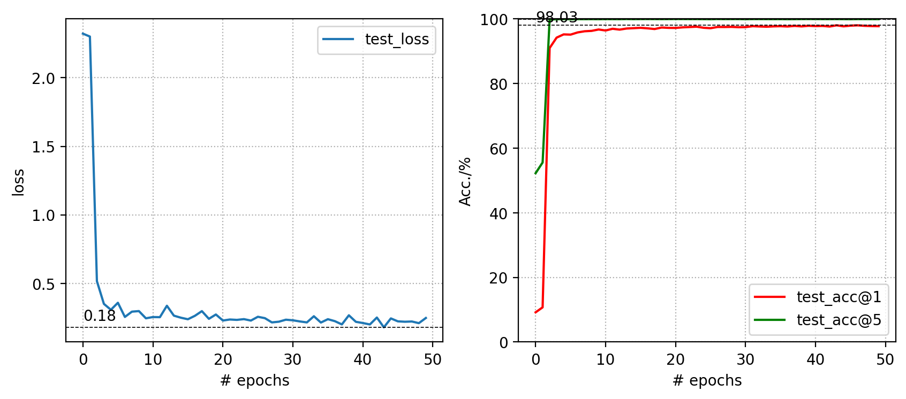
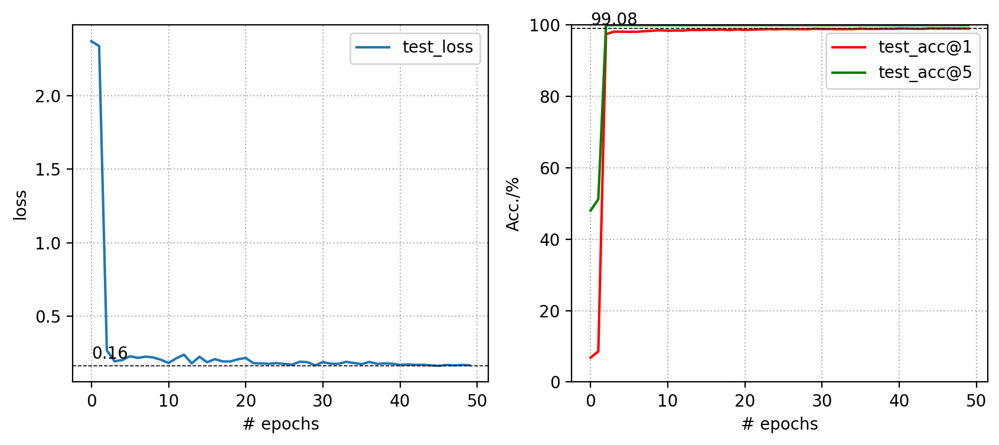
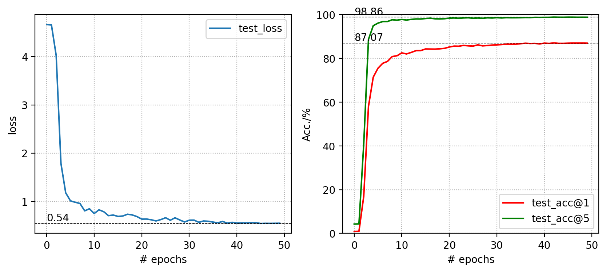
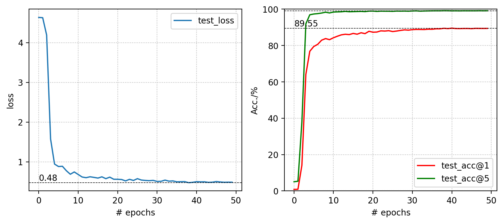
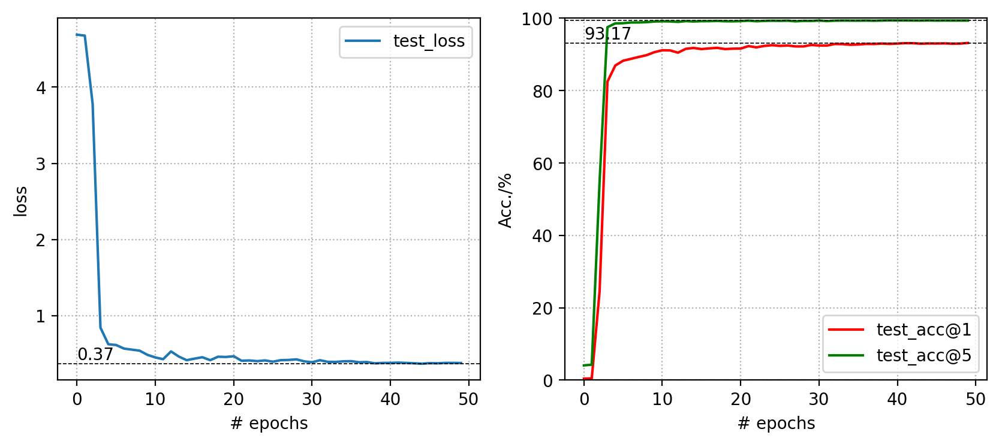

# Swin Transformer

## Evaluate Model Pre-trained on ImageNet-1k

### Usage
- Pull the official swin repository from Microsoft by `git pull https://github.com/microsoft/Swin-Transformer.git`.
- Install per instruction in `get_started.md` included in the official repo.
- `$ chmod u+x <fileName.sh>` to add permission to shell script.
- To evaluate: Set path and run `$ ./eval.sh`.
- To transfer: Per instruction in `./Deit`, set path and run `$ ./transfer_swin_tiny.sh`.

### Expected Output
All logs saved in `./output` folder

- swin_tiny_patch4_window7_224
    - \* Acc@1 81.160 Acc@5 95.478
    - Accuracy of the network on the 50000 test images: 81.2%

- swin_small_patch4_window7_224
    - \* Acc@1 83.188 Acc@5 96.226
    - Accuracy of the network on the 50000 test images: 83.2%

- swin_base_patch4_window7_224
    - \* Acc@1 83.478 Acc@5 96.464
    - Accuracy of the network on the 50000 test images: 83.5%

- swin_base_patch4_window12_384_finetune
    - \* Acc@1 84.458 Acc@5 96.956
    - Accuracy of the network on the 50000 test images: 84.5%

## Model Analysis

| name | resolution |acc@1 | acc@5 | #params | FLOPs |
|:---:|:---:|:---:|:---:| :---:| :---:|
| Swin-T | 224x224 | 81.2 | 95.5 | 28M | 4.5G | 
| Swin-S | 224x224 | 83.2 | 96.2 | 50M | 8.7G | 
| Swin-B | 224x224 | 83.5 | 96.5 | 88M | 15.4G | 
| Swin-B | 384x384 | 84.5 | 97.0 | 88M | 47.1G | 

## Swin Transfer Experiments

### Transfer to CIFAR10
#### pretrained swin-tiny

#### pretrained swin-small

#### pretrained swin-base

### Transfer to CIFAR100
#### pretrained swin-tiny

#### pretrained swin-small

#### pretrained swin-base

## Reference
[1] Official implementation for "Swin Transformer: Hierarchical Vision Transformer using Shifted Windows". [[GitHub](https://github.com/microsoft/Swin-Transformer)]
