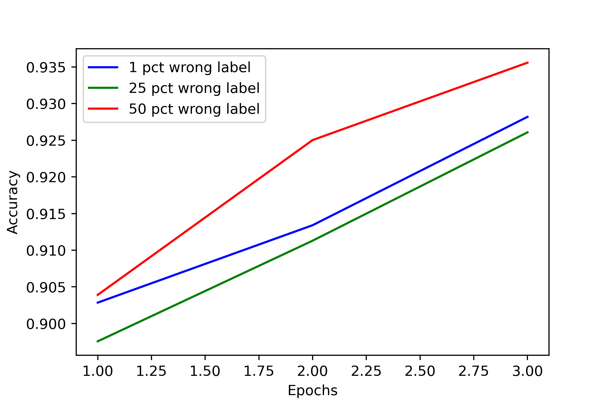

# Imagewoof

Imagewoof is a subset of Imagenet that is similar to Imagenette except it is a dataset with 10 dog classes (Australian terrier, Border terrier, Samoyed, Beagle, Shih-Tzu, English foxhound, Rhodesian ridgeback, Dingo, Golden retriever, Old English sheepdog).

Also, it comes with a set of labels that ranges from 0\% incorrect to 50\% incorrect. In between, we have 1\%, 5\% and 25\% incorrect.

It was found out that pretrained vision transformers are reasonably robust to incorrect labels and also few datapoints, with 90.7\% for all-correct labels and 92.6\% for 50\% correct labels evaluated on validation set.

According to the creator of this dataset, it serves as a small set that can be used to test whether a certain idea work, since Imagenet is too large.

Here is the link to some of the other models that was kept on record: https://github.com/fastai/imagenette/

To run the notebooks: for both Imagenette and Imagewoof, one needs to change the data location from XXXX.JPEG to XXXX.jpeg in order for it to function.

#### Transfer on Imagenette (metric: accuracy)

