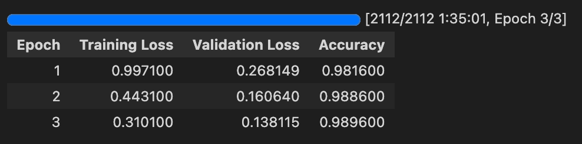
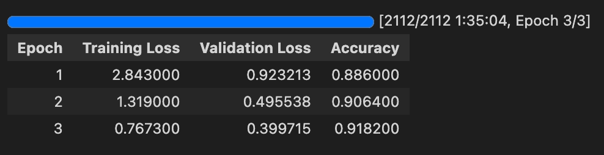

# Result Log

## Fine-tuning ViT on CIFAR-10

### Hyper-Parametrers
| Parameters    | Value     |
| -----------   | ----------|
| # of epoch    | 3         |
| batch size    | 64        |
| learning rate | 2e-5      |
| weight decay  | 0.01      |

### Train Log

### Test Acc
- our test_acc:     98.96%
- original paper: 98.95%

## Fine-tuning ViT on CIFAR-100

### Hyper-Parametrers
| Parameters    | Value     |
| -----------   | ----------|
| # of epoch    | 3         |
| batch size    | 64        |
| learning rate | 1e-4      |
| weight decay  | 0.01      |

### Train Log

### Test Acc
- our test_acc:     91.81%
- original paper: 91.67%

# Imagenette

Imagenette is a subset of Imagenet with 10 distinct classes (tench, English springer, cassette player, chain saw, church, French horn, garbage truck, gas pump, golf ball, parachute). Altogether, it has 9369 training images and 4025 validation images. 

Also, it comes with a set of labels that ranges from 0\% incorrect to 50\% incorrect. In between, we have 1\%, 5\% and 25\% incorrect.

It was found out that pretrained vision transformers are fairly robust to incorrect labels and also few datapoints, with 98.1\% for all-correct labels and 97.9\% for 50\% correct labels evaluated on validation set.

According to the creator of this dataset, it serves as a small set that can be used to test whether a certain idea work, since Imagenet is too large.

Here is the link to some of the other models that was kept on record: https://github.com/fastai/imagenette/

#### Transfer on Imagenette (metric: accuracy)

# Imagewoof

Imagewoof is a subset of Imagenet that is similar to Imagenette except it is a dataset with 10 dog classes (Australian terrier, Border terrier, Samoyed, Beagle, Shih-Tzu, English foxhound, Rhodesian ridgeback, Dingo, Golden retriever, Old English sheepdog).

Also, it comes with a set of labels that ranges from 0\% incorrect to 50\% incorrect. In between, we have 1\%, 5\% and 25\% incorrect.

It was found out that pretrained vision transformers are reasonably robust to incorrect labels and also few datapoints, with 90.7\% for all-correct labels and 92.6\% for 50\% correct labels evaluated on validation set.

According to the creator of this dataset, it serves as a small set that can be used to test whether a certain idea work, since Imagenet is too large.

Here is the link to some of the other models that was kept on record: https://github.com/fastai/imagenette/

#### Transfer on Imagenette (metric: accuracy)

