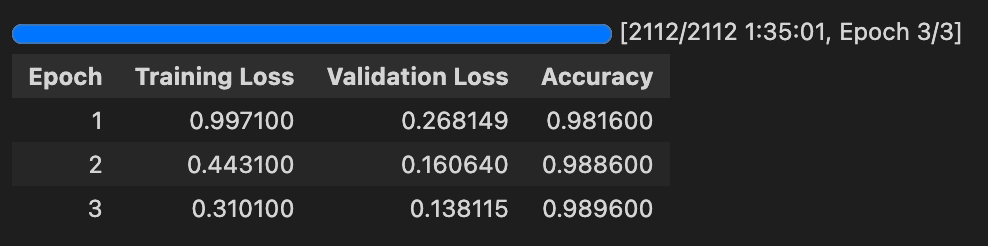

# Result Log

## Fine-tuning ViT on CIFAR-10

### Hyper-Parametrers
| Parameters    | Value     |
| -----------   | ----------|
| # of epoch    | 3         |
| batch size    | 64        |
| learning rate | 2e-5      |
| weight decay  | 0.01      |

### Train Log

### Test Acc
- our test_acc:     98.96%
- original paper: 98.95%

## Fine-tuning ViT on CIFAR-100

### Hyper-Parametrers
| Parameters    | Value     |
| -----------   | ----------|
| # of epoch    | 3         |
| batch size    | 64        |
| learning rate | 1e-4      |
| weight decay  | 0.01      |

### Train Log

### Test Acc
- our test_acc:     91.81%
- original paper: 91.67%

